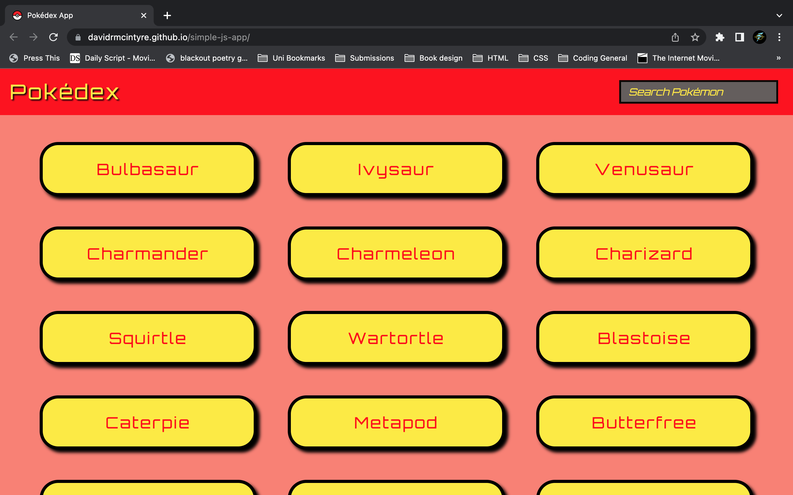

# Pokédex JS App 

##  Project Description: 

A web application using HTML, CSS and JavaScript that loads data from an external API and enables the viewing of data points in detail by displaying a list of pokemon as buttons, which when clicked will display a picture of the pokemon as well as information including: name, height, types and abilities within a modal.

## Intructions: 

Simply [visit the app here](https://davidrmcintyre.github.io/simple-js-app/)
Make sure to try the search function.

## API

(https://pokeapi.co/api/v2/pokemon/?limit=151)

## Technologies

HTML, CSS, JavaScript

## Libaries

jQuery, Bootstrap

### Interface Examples

How the display will look on a desktop.

